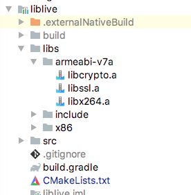
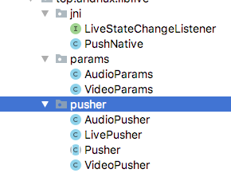

### 本项目基于FAAC + libx264 + openssl + librtmp 实现

#### 快速使用：
```
    private LivePusher mLivePusher;
    private static final String URL = "rtmp://106.13.8.37/live/test";

    @Override
    protected void onCreate(Bundle savedInstanceState) {
        super.onCreate(savedInstanceState);
        setContentView(R.layout.activity_main);
        SurfaceView surfaceView = findViewById(R.id.surfaceView);
        mLivePusher = new LivePusher(surfaceView.getHolder());
    }

    public void swithCamera(View view) {
        mLivePusher.swithCamera();
    }

    public void stopLive(View view) {
        mLivePusher.stopPush();
    }

    public void startLive(View view) {
        mLivePusher.startPush(URL);
    }
```
#### 项目结构：


#### 视频采集（VideoPusher）：
只帖了主要代码，具体代码: [VideoPusher](https://github.com/andnux/LiveDemo/blob/master/liblive/src/main/java/top/andnux/liblive/pusher/VideoPusher.java)
```
try {
   mCamera = Camera.open(mVideoParams.getCameraId());
   Camera.Parameters parameters = mCamera.getParameters();
   parameters.setPreviewFormat(ImageFormat.NV21);
   parameters.setPreviewSize(mVideoParams.getWidth(),mVideoParams.getHeight());
   mCamera.setParameters(parameters);
   mCamera.setPreviewCallback(this);
   mCamera.setPreviewDisplay(mHolder);
   mCamera.startPreview();
   } catch (Throwable e) {
       e.printStackTrace();
   }
```
#### 音频采集（AudioPusher）：
只帖了主要代码，具体代码: [AudioPusher](https://github.com/andnux/LiveDemo/blob/master/liblive/src/main/java/top/andnux/liblive/pusher/AudioPusher.java)
```
try {
     int audioSource = MediaRecorder.AudioSource.MIC;
     int channelConfig = mAudioParams.getChannel() == 1 ?
             AudioFormat.CHANNEL_IN_MONO : AudioFormat.CHANNEL_IN_STEREO;
     int minBufferSize = AudioRecord.getMinBufferSize(mAudioParams.getSampleRateInHz(),
             channelConfig, mAudioParams.getAudioFormat());
     mAudioRecord = new AudioRecord(audioSource, mAudioParams.getSampleRateInHz(),
             channelConfig, mAudioParams.getAudioFormat(),
             Math.max(minBufferSize, BUFFER_SIZE));
     mAudioRecord.startRecording();
     while (isPushing) {
         byte[] bytes = new byte[minBufferSize];
         int len = mAudioRecord.read(bytes, 0, bytes.length);
         if (len > 0) {
             //进行录音编码
             Log.d("TAG", "音频编码中...");
             mPushNative.sendAudio(bytes, len);
         }
        }
    } catch (Throwable e) {
     e.printStackTrace();
 }
```
#### 直播管理类LivePusher：
```
    public LivePusher(SurfaceHolder holder) {
        mHolder = holder;
        mHolder.setKeepScreenOn(true);
        mHolder.addCallback(this);
        prepare();
    }

    private void prepare() {
        mPushNative = new PushNative();
        VideoParams videoParams = new VideoParams(480, 320,
                Camera.CameraInfo.CAMERA_FACING_BACK, 480000, 25);
        mVideoPusher = new VideoPusher(mHolder, videoParams, mPushNative);
        AudioParams audioParams = new AudioParams();
        mAudioPusher = new AudioPusher(audioParams, mPushNative);
    }

    public void startPush(String url) {
        mVideoPusher.startPush();
        mAudioPusher.startPush();
        mPushNative.startPush(url);
    }

    public void stopPush() {
        mVideoPusher.stopPush();
        mAudioPusher.stopPush();
        mPushNative.stopPush();
        mPushNative.release();
    }
```
#### Native接口 (PushNative.java)：
```
    public native void startPush(String url);

    public native void stopPush();

    public native void release();

    public native void setVideoOptions(int width, int height,
                                       int bitrate, int fps);

    public native void setAudioOptions(int sampleRateInHz,
                                       int channel, int audioFormat);

    public native void sendVideo(byte[] data);

    public native void sendAudio(byte[] data, int length);
```
#### 核心C++实现：
只帖了主要代码，具体代码: [live.cpp](https://github.com/andnux/LiveDemo/blob/master/liblive/src/main/cpp/live.cpp)
```
extern void add_aac_sequence_header();

extern void add_aac_body(unsigned char *buf, int len);

extern void *push_thread(void *arg);

extern void throwNativeError(JNIEnv *env, int code);

extern void
add_264_sequence_header(unsigned char *pps, unsigned char *sps, int pps_len, int sps_len);

extern void add_264_body(unsigned char *buf, int len);

extern void add_rtmp_packet(RTMPPacket *packet);
```